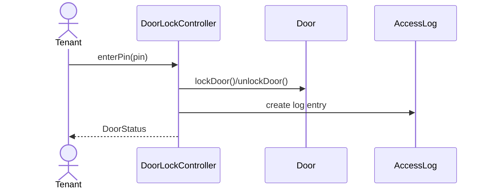
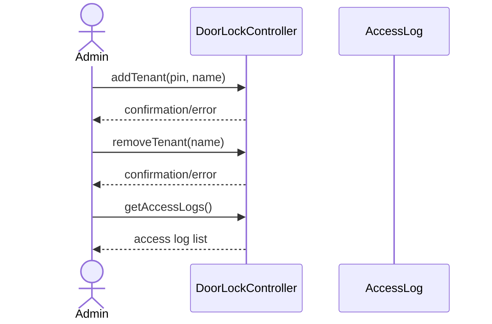

## Exercise 2 - Sequence Diagrams

### Tenant access

```mermaid
sequenceDiagram
    actor Tenant
    participant Controller as DoorLockController
    participant Door
    participant Log as AccessLog

    Tenant->>Controller: enterPin(pin)
    Controller->>Door: lockDoor()/unlockDoor()
    Controller->>Log: create log entry
    Controller-->>Tenant: DoorStatus
```

### Admin management

```mermaid
sequenceDiagram
    actor Admin
    participant Controller as DoorLockController
    participant Log as AccessLog

    Admin->>Controller: addTenant(pin, name)
    Controller-->>Admin: confirmation/error

    Admin->>Controller: removeTenant(name)
    Controller-->>Admin: confirmation/error

    Admin->>Controller: getAccessLogs()
    Controller-->>Admin: access log list
```
